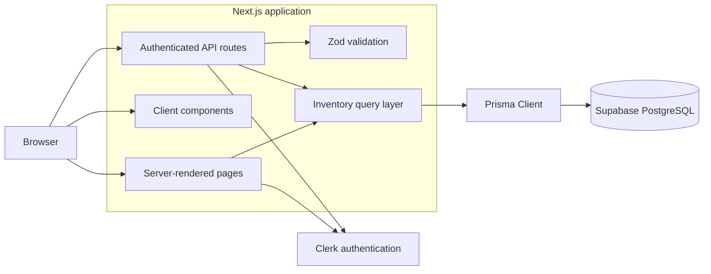

# MyKitchen

MyKitchen is a full-stack kitchen inventory application for tracking food and household items stored in a fridge, freezer, or pantry.

The application helps users monitor quantities, purchase dates, opened dates, and expiration dates while providing fast search, filtering, sorting, and common inventory actions.

> **Project status:** MVP hardening and deployment preparation

## Live Demo

Deployment is planned after automated testing and production hardening are complete.

- **Live application:** Coming soon
- **Repository:** This repository

## Problem

Kitchen inventory is often tracked mentally, which makes it easy to forget what is available, buy duplicate items, or allow food to expire.

MyKitchen provides a centralized inventory where users can quickly:

- See what is currently available
- Organize items by storage location
- Identify expired and expiring items
- Update quantities without opening a full edit form
- Search and filter a growing inventory

## Feature Highlights

### Inventory Management

- Create, view, edit, and delete inventory items
- Organize items by fridge, freezer, or pantry
- Track quantity and measurement unit
- Track purchase, opened, and expiration dates
- Increase or decrease quantities directly from inventory cards
- Mark an item as opened without visiting the edit page

### Inventory Discovery

- Search by item name
- Filter by storage location
- Filter by category
- Filter by expiration status
- Filter by opened status
- Sort by recently added, name, purchase date, or expiration date

### Dashboard

- Total inventory count
- Fridge, freezer, and pantry counts
- Expired-item count
- Expiring-soon count
- Recently added items
- Items requiring attention

### Authentication and Security

- Clerk authentication
- Protected application routes
- Authenticated API routes
- Per-user inventory ownership
- UUID route-parameter validation
- Zod validation at API boundaries

### User Experience

- Responsive card-based inventory grid
- Mobile-friendly add and edit forms
- Loading and disabled states for form submissions
- Inline validation messages
- Static suggested item images
- Category-based image fallbacks

## Screenshots

Screenshots will be added after the final responsive review.

Planned screenshots:

- Dashboard on desktop
- Inventory grid on desktop
- Add-item form
- Inventory on a mobile viewport

See [`screenshots/README.md`](screenshots/README.md) for the capture plan.

## Technology Stack

| Area | Technology |
|---|---|
| Framework | Next.js App Router |
| Language | TypeScript |
| User interface | React and Tailwind CSS |
| Authentication | Clerk |
| Database access | Prisma 7 |
| Database | PostgreSQL hosted by Supabase |
| Validation | Zod |
| Image handling | Next.js Image and local static assets |
| Code quality | ESLint and TypeScript production builds |

Exact dependency versions are recorded in `package.json` and `package-lock.json`.

## Architecture at a Glance



More detail is available in [`docs/ARCHITECTURE.md`](docs/ARCHITECTURE.md).

## Key Engineering Decisions

| Decision | Reason |
|---|---|
| Derive expiration status instead of storing it | Stored statuses would become stale as time passes |
| Authenticate inside API routes | Protecting pages alone does not protect direct API requests |
| Include `userId` in database queries | Prevents users from accessing inventory records they do not own |
| Validate on both the client and server | Client validation improves usability; server validation provides security |
| Use server-confirmed quick updates | Simpler and more reliable than optimistic updates for the MVP |
| Resolve suggested images from item names | Provides useful visuals without image uploads, API costs, or schema changes |
| Require review before future automated imports | Receipt and barcode data can be incomplete or inaccurate |

## Current Data Model

Each kitchen item records:

- Item name
- Category
- Storage location
- Quantity
- Unit
- Date bought
- Optional opened date
- Optional expiration date
- Optional notes
- Owning Clerk user
- Creation and update timestamps

Expiration status is calculated as one of:

- `expired`
- `expiring_soon`
- `fresh`
- `no_date`

## API Routes

| Method | Route | Purpose |
|---|---|---|
| `GET` | `/api/items` | Retrieve the authenticated user's inventory |
| `POST` | `/api/items` | Create an inventory item |
| `GET` | `/api/items/[id]` | Retrieve one owned item |
| `PATCH` | `/api/items/[id]` | Partially update one owned item |
| `DELETE` | `/api/items/[id]` | Delete one owned item |

All item routes require authentication and enforce record ownership.

## Application Routes

| Route | Purpose |
|---|---|
| `/` | Public landing page |
| `/sign-in` | Sign-in page |
| `/sign-up` | Registration page |
| `/dashboard` | Inventory overview |
| `/inventory` | Searchable and filterable inventory |
| `/inventory/new` | Add an inventory item |
| `/inventory/[id]/edit` | Edit an inventory item |

## Local Development

### Requirements

- Node.js 22 or later
- npm
- PostgreSQL database
- Clerk development application

### Installation

Clone the repository:

```bash
git clone https://github.com/YOUR-GITHUB-USERNAME/mykitchen.git
cd mykitchen
```

Install dependencies:

```bash
npm install
```

Create a local environment file:

```bash
cp .env.example .env.local
```

Provide your own Clerk and database credentials in `.env.local`.

Never commit `.env.local` or share its contents.

Apply database migrations:

```bash
npx prisma migrate dev
```

Generate Prisma Client:

```bash
npx prisma generate
```

Start the development server:

```bash
npm run dev
```

Open:

```text
http://localhost:3000
```

## Available Scripts

```bash
npm run dev
```

Starts the Next.js development server.

```bash
npm run lint
```

Runs ESLint static analysis.

```bash
npm run build
```

Creates and type-checks the optimized production build.

```bash
npm run start
```

Runs a previously generated production build.

## Quality Checks

Before committing a change:

```bash
npm run lint && npm run build
```

Current quality checks include:

- ESLint static analysis
- TypeScript checking through the production build
- Next.js production compilation
- Manual browser testing

Planned hardening includes:

- Unit tests for date logic
- Unit tests for Zod validation
- Unit tests for image resolution
- API integration tests
- End-to-end user-flow tests

## Project Structure

```text
app/
  (app)/                    Protected application pages
  (auth)/                   Clerk authentication pages
  api/items/                Inventory API routes

components/
  inventory/                Forms, cards, filters, and item actions
  layout/                   Shared application navigation

docs/
  ARCHITECTURE.md           Technical design and data flow
  MVP_CHECKLIST.md          Release-readiness checklist

lib/
  api/                      Shared API error responses
  generated/prisma/         Generated Prisma Client
  items/                    Inventory queries and serializers
  dates.ts                  Date and expiration helpers
  item-images.ts            Suggested-image resolver
  prisma.ts                 Prisma Client configuration

prisma/
  migrations/               Database migration history
  schema.prisma             Database schema

public/item-images/         Reusable item illustrations
screenshots/                Portfolio screenshots
types/                      Shared TypeScript types
validations/                Zod schemas
```

## Roadmap

### MVP Hardening

- Automated tests
- Loading states
- Error boundaries
- Not-found pages
- Accessibility review
- Responsive design review
- Production deployment
- Portfolio screenshots

### Future Features

- UPC and EAN barcode scanning
- Product database lookup
- Receipt photo and upload processing
- Reviewable bulk item imports
- User-uploaded item images
- Recipe suggestions based on available inventory

Automated imports will create reviewable drafts rather than immediately inserting records.

## What I Learned

This project has provided practical experience with:

- Designing a full-stack application using the Next.js App Router
- Dividing responsibilities between server and client components
- Protecting routes and database queries with user ownership checks
- Validating untrusted data at API boundaries
- Designing and migrating a relational database schema
- Handling date-only values consistently
- Building reusable form, card, and filtering components
- Evaluating tradeoffs between simplicity and more advanced architecture

This section will continue to be updated as the project reaches production.
