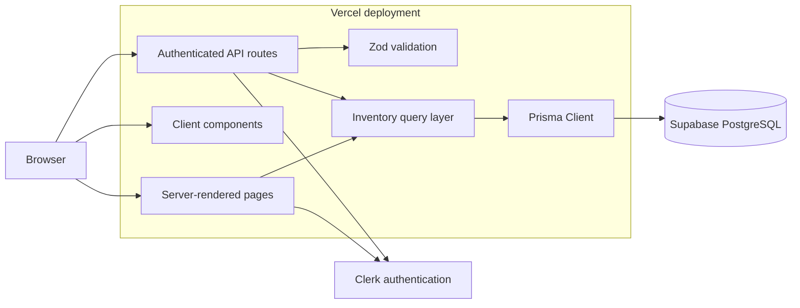

# MyKitchen

MyKitchen is a full-stack kitchen inventory application for tracking food and household items stored in a fridge, freezer, or pantry.

It helps users monitor quantities, purchase dates, opened dates, and expiration dates while providing fast search, filtering, sorting, and common inventory actions.

> **Project status:** Functional MVP deployed and publicly available

## Live Demo

- **Live application:** https://my-kitchen-drab.vercel.app/
- **Repository:** https://github.com/aidankim324/MyKitchen

The live deployment uses Clerk authentication and a PostgreSQL database hosted by Supabase. Each authenticated user maintains a separate inventory.

## Problem

Kitchen inventory is often tracked mentally, making it easy to forget what is available, purchase duplicate items, or allow food to expire.

MyKitchen provides a centralized inventory where users can:

- See what is currently available
- Organize items by storage location
- Identify expired and expiring items
- Update quantities without opening a full edit form
- Search and filter a growing inventory
- Review recently added items and items requiring attention

## Feature Highlights

### Inventory Management

- Create, view, edit, and delete inventory items
- Organize items by fridge, freezer, or pantry
- Track quantity and measurement unit
- Track purchase, opened, and expiration dates
- Increase or decrease quantities directly from inventory cards
- Mark an item as opened without visiting the edit page
- Maintain separate inventory data for each user

### Search and Organization

- Search by item name
- Filter by storage location
- Filter by category
- Filter by expiration status
- Filter by opened status
- Sort by recently added, name, purchase date, or expiration date
- View live result counts
- Clear active filters

### Dashboard

- Total inventory count
- Fridge, freezer, and pantry counts
- Expired-item count
- Expiring-soon count
- Recently added items
- Items requiring attention

### Authentication and Security

- Clerk authentication
- Protected application routes
- Authenticated API routes
- Per-user inventory ownership
- UUID route-parameter validation
- Zod validation at API boundaries
- Server-side authorization checks
- Environment-based credential management

### Reliability and Accessibility

- Responsive desktop and mobile layouts
- Route-level loading states
- Application error boundaries
- Custom not-found pages
- Disabled and loading states for mutations
- Inline form and API error messages
- Keyboard-visible focus states
- Accessible control names and labels
- Reduced-motion support
- Mobile Add Item action

## Technology Stack

| Area | Technology |
|---|---|
| Framework | Next.js 16 App Router |
| Language | TypeScript |
| User interface | React 19 and Tailwind CSS 4 |
| Authentication | Clerk |
| Database access | Prisma 7 |
| Database | PostgreSQL hosted by Supabase |
| Validation | Zod |
| Image handling | Next.js Image and local static assets |
| Unit testing | Vitest |
| Coverage | Vitest V8 coverage |
| Code quality | ESLint, TypeScript, and production builds |
| Deployment | Vercel |

Exact dependency versions are recorded in `package.json` and `package-lock.json`.

## Architecture at a Glance



More detail is available in [`docs/ARCHITECTURE.md`](docs/ARCHITECTURE.md).

## Key Engineering Decisions

| Decision | Reason |
|---|---|
| Derive expiration status instead of storing it | Stored statuses would become stale as time passes |
| Authenticate inside API routes | Protecting pages alone does not protect direct API requests |
| Include `userId` in database queries | Prevents users from accessing inventory records they do not own |
| Validate on both the client and server | Client validation improves usability; server validation provides security |
| Use server-confirmed quick updates | Simpler and more reliable than optimistic updates for the MVP |
| Resolve suggested images from item names | Provides useful visuals without uploads, API costs, or schema changes |
| Generate Prisma Client during install and build | Keeps generated code out of Git while ensuring deployments have a current client |
| Require review before future automated imports | Receipt and barcode data can be incomplete or inaccurate |

## Data Model

Each kitchen item records:

- Item name
- Category
- Storage location
- Quantity
- Unit
- Date bought
- Optional opened date
- Optional expiration date
- Optional notes
- Owning Clerk user
- Creation and update timestamps

Expiration status is derived as one of:

- `expired`
- `expiring_soon`
- `fresh`
- `no_date`

## API Routes

| Method | Route | Purpose |
|---|---|---|
| `GET` | `/api/items` | Retrieve the authenticated user's inventory |
| `POST` | `/api/items` | Create an inventory item |
| `GET` | `/api/items/[id]` | Retrieve one owned item |
| `PATCH` | `/api/items/[id]` | Partially update one owned item |
| `DELETE` | `/api/items/[id]` | Delete one owned item |

All item routes require authentication and enforce record ownership.

## Application Routes

| Route | Purpose |
|---|---|
| `/` | Public landing page |
| `/sign-in` | Sign-in page |
| `/sign-up` | Registration page |
| `/dashboard` | Inventory overview |
| `/inventory` | Searchable and filterable inventory |
| `/inventory/new` | Add an inventory item |
| `/inventory/[id]/edit` | Edit an inventory item |

## Automated Testing

The unit-test suite covers:

- UTC date-only conversion and validation
- Expiration-status calculation
- Leap years and invalid calendar dates
- Item-image suggestion rules
- Zod create and update validation
- Prisma-to-application serialization
- Null optional fields and quantity conversion

Current results:

```text
Test files: 4 passed
Tests:      39 passed
Statements: 98.48%
Branches:   97.05%
Functions:  93.33%
Lines:      98.46%
```

Run the complete quality gate:

```bash
npm run check
```

The quality gate runs:

1. ESLint
2. Vitest
3. Prisma Client generation
4. Next.js production build and TypeScript checking

## Local Development

### Requirements

- Node.js 22 or later
- npm
- PostgreSQL database
- Clerk development application

### Installation

Clone the repository:

```bash
git clone https://github.com/aidankim324/MyKitchen.git
cd MyKitchen
```

Install dependencies:

```bash
npm install
```

Create a local environment file:

```bash
cp .env.example .env.local
```

Provide your own Clerk and database credentials in `.env.local`.

Never commit `.env.local` or share its contents.

Apply database migrations:

```bash
npm run prisma:migrate
```

Start the development server:

```bash
npm run dev
```

Open:

```text
http://localhost:3000
```

## Available Scripts

| Command | Purpose |
|---|---|
| `npm run dev` | Start the local development server |
| `npm run build` | Generate Prisma Client and create a production build |
| `npm run start` | Run a completed production build |
| `npm run lint` | Run ESLint |
| `npm test` | Run the unit-test suite |
| `npm run test:watch` | Run tests in watch mode |
| `npm run test:coverage` | Generate a coverage report |
| `npm run check` | Run linting, tests, and a production build |
| `npm run prisma:generate` | Generate Prisma Client |
| `npm run prisma:migrate` | Create and apply a development migration |
| `npm run prisma:deploy` | Apply existing migrations |
| `npm run prisma:studio` | Open Prisma Studio |

## Project Structure

```text
app/
  (app)/                    Protected application pages
  (auth)/                   Clerk authentication pages
  api/items/                Authenticated inventory API routes

components/
  inventory/                Forms, cards, filters, and item actions
  layout/                   Shared application navigation

docs/
  ARCHITECTURE.md           Technical design and data flow

lib/
  api/                      Shared API error responses
  items/                    Inventory queries and serializers
  generated/prisma/         Generated locally and ignored by Git
  dates.ts                  UTC date-only utilities
  item-images.ts            Suggested-image resolver
  prisma.ts                 Prisma Client configuration

prisma/
  schema.prisma             Database schema

tests/
  dates.test.ts
  item-images.test.ts
  item-serializers.test.ts
  item-validation.test.ts

validations/
  item.ts                   Request and form schemas
```

## Current Limitations

- Quantity quick actions send an absolute value rather than an atomic database increment.
- Images are selected from a local static catalog rather than uploaded by users.
- Barcode and receipt imports are not implemented.
- API integration and browser end-to-end tests are still planned.
- Production monitoring currently relies on Vercel runtime logs.

## Roadmap

Potential future work includes:

- UPC and EAN barcode scanning
- Product-database lookup
- Receipt image processing
- Bulk review of imported item drafts
- User-uploaded images
- Recipe suggestions based on available inventory
- Atomic quantity updates
- API integration tests
- End-to-end authentication and CRUD tests
- Dedicated error monitoring
