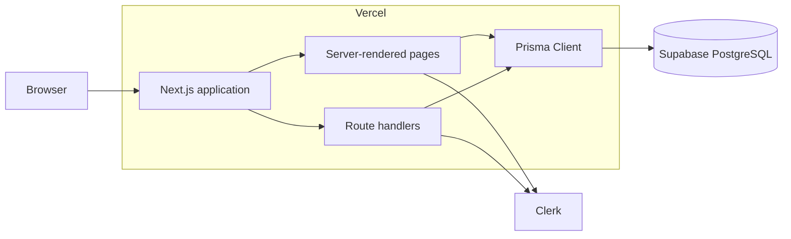
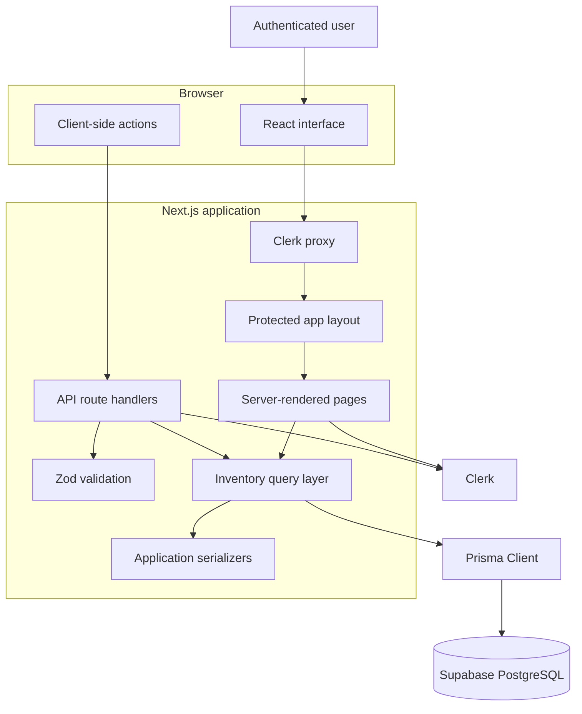
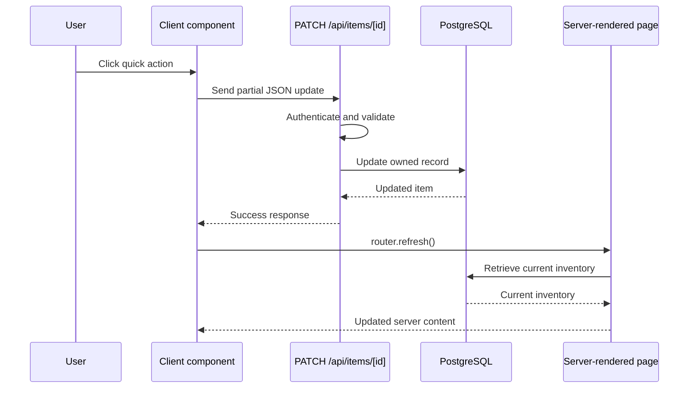
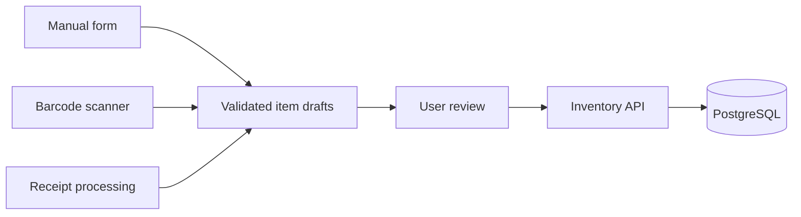

# MyKitchen Architecture

## Overview

MyKitchen is a deployed full-stack application built with the Next.js App Router.

It combines:

- Server-rendered application pages
- Client-side interactive components
- Authenticated API route handlers
- Zod request validation
- A Prisma data-access layer
- PostgreSQL persistence
- Clerk authentication
- Vercel deployment

## Deployment

The production application is available at:

```text
https://my-kitchen-drab.vercel.app/
```

Vercel builds and serves the Next.js application. Clerk manages authentication, while Prisma connects the server-side application to PostgreSQL hosted by Supabase.



## Application Architecture



## Authentication

Clerk handles:

- User registration
- Sign-in
- Sessions
- User identifiers
- User-menu controls

Protected application pages are grouped under:

```text
app/(app)
```

The protected layout checks authentication before rendering its children.

API routes perform their own authentication checks. Protecting pages alone does not prevent an unauthenticated caller from attempting a direct API request.

## Authorization and Data Ownership

Every kitchen item belongs to a Clerk user through its `userId`.

Database operations on existing items include both:

- The item UUID
- The authenticated user's Clerk ID

Conceptually:

```text
Find item where:
  id = requested item ID
  AND
  userId = authenticated user ID
```

This prevents one authenticated user from reading, editing, or deleting another user's inventory.

The application does not treat possession of an item UUID as proof of ownership. Missing items and unauthorized item IDs both produce not-found behavior, which avoids revealing whether another user's record exists.

## Request Validation

Zod schemas are defined in:

```text
validations/item.ts
```

They validate:

- Create-item requests
- Partial update requests
- Client-side form submissions

Client-side validation provides immediate feedback, but the server validates again because browser input cannot be trusted.

Dynamic item route parameters are also validated as UUIDs before database access.

## Data Access

Prisma is the only interface used by application code to communicate with PostgreSQL.

Important files include:

```text
prisma/schema.prisma
prisma.config.ts
lib/prisma.ts
lib/items/queries.ts
lib/items/serializers.ts
```

### `lib/prisma.ts`

- Configures Prisma Client
- Configures the PostgreSQL adapter
- Reuses the client during development

### `lib/items/queries.ts`

- Owns inventory database operations
- Applies user-ownership requirements
- Maps validated application input into Prisma operations

### `lib/items/serializers.ts`

- Converts Prisma values into application-safe values
- Converts Prisma Decimal values into numbers
- Converts database dates into date-only strings
- Converts timestamps into ISO strings

## Prisma Client Generation

Generated Prisma Client files are not committed to Git.

The project generates them automatically through:

```json
{
  "postinstall": "prisma generate",
  "prebuild": "prisma generate"
}
```

This ensures that:

- Local installs receive a current Prisma Client
- Vercel builds generate the client before compiling Next.js
- Generated implementation files do not create repository noise
- Prisma Client remains synchronized with `prisma/schema.prisma`

## Rendering Model

The application uses both server and client components.

### Server responsibilities

- Check authentication
- Retrieve inventory data
- Render initial application state
- Keep database credentials on the server
- Enforce user ownership in data queries

### Client responsibilities

- Search and filter already-loaded inventory
- Submit create and edit forms
- Delete items
- Perform quantity changes
- Mark items as opened
- Display loading and error states
- Refresh server-rendered data after mutations

## Mutation Flow

Quick actions follow this flow:



The MVP uses server-confirmed updates rather than optimistic updates.

This avoids showing a successful change before the database confirms it and keeps failure recovery straightforward.

## Current Concurrency Limitation

Quick quantity actions calculate an absolute value in the browser:

```text
Current quantity: 2
User clicks +
Request body: { quantity: 3 }
```

If two devices update the same item simultaneously, the later request could overwrite the earlier request.

For a personal inventory MVP, this tradeoff is acceptable.

A future implementation could use:

- Atomic database increments
- Version numbers
- Optimistic concurrency control

## Date Model

Kitchen items contain:

```text
dateBought
openedDate
expirationDate
```

`dateBought` is required.

`openedDate` and `expirationDate` are optional.

These values represent calendar dates rather than specific moments in time. Date-only helpers use UTC components to avoid accidental date changes caused by local time zones.

## Expiration Status

Expiration status is derived at request or render time:

```text
expired
expiring_soon
fresh
no_date
```

It is not stored in the database.

Storing it would produce stale data. An item marked `fresh` today could become expired later without any database update.

## Image Resolution

The current image system uses a deterministic resolver:

```text
Item name
  |
  v
Normalize text
  |
  v
Check phrase rules
  |
  +--> Match found: use local suggested image
  |
  +--> No match: use category icon
```

This provides a visual inventory without:

- External image APIs
- Image-generation costs
- File uploads
- Storage configuration
- Additional database fields

## Loading, Error, and Not-Found Handling

The protected application includes:

```text
app/(app)/loading.tsx
app/(app)/error.tsx
app/(app)/not-found.tsx
```

The public application also includes:

```text
app/not-found.tsx
```

These provide:

- Route-level loading feedback
- Retry behavior after rendering failures
- Safe missing-item handling
- Public and authenticated not-found pages

## Accessibility

Accessibility work includes:

- A skip-to-content link
- Semantic navigation labels
- Visible keyboard focus
- Accessible names for icon-only and quantity controls
- Live result-count announcements
- Mutation status announcements
- Alert roles for errors
- Minimum touch-target sizing
- Reduced-motion behavior

A formal assistive-technology audit remains outside the current MVP scope.

## Automated Testing

Vitest covers the application's isolated business logic:

- Date-only parsing and conversion
- Expiration-state boundaries
- Leap-year and invalid-date behavior
- Image suggestion rules
- Zod validation
- Inventory serialization

Current test results:

```text
39 tests passing
98.48% statement coverage
97.05% branch coverage
93.33% function coverage
98.46% line coverage
```

The complete local quality gate is:

```bash
npm run check
```

It runs linting, unit tests, Prisma generation, type checking, and the production build.

## Deployment Validation

The deployed application has been manually tested for:

- Public landing-page access
- User registration
- User sign-in
- Protected-route access
- Inventory creation
- Inventory editing
- Quantity updates
- Mark-opened updates
- Persistence after refresh
- Inventory deletion
- Custom not-found behavior
- Mobile layout
- Vercel runtime errors

## Future Automated Item Entry

Future import methods should create drafts rather than immediately saving inventory records.



Barcode and receipt data can be incomplete or inaccurate. Requiring review prevents incorrect records from entering the inventory.

## Important Invariants

The application should preserve these rules:

1. Every inventory item belongs to exactly one Clerk user.
2. API routes authenticate independently from page layouts.
3. Item ownership is enforced inside database queries.
4. External input passes Zod validation.
5. Item route parameters are valid UUIDs.
6. Date-only values remain date-only throughout serialization.
7. Expiration status is derived rather than stored.
8. Automated imports require user confirmation.
9. Secret credentials are never sent to the browser or committed to Git.
10. Generated Prisma Client files remain synchronized with the schema.
