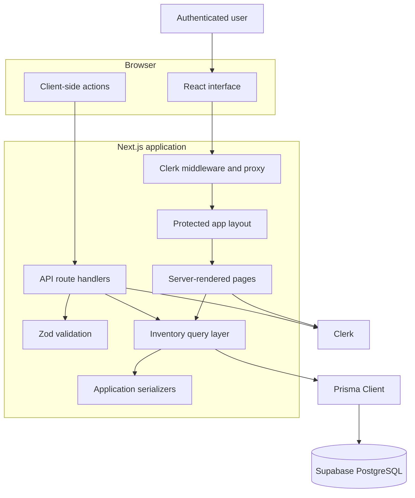
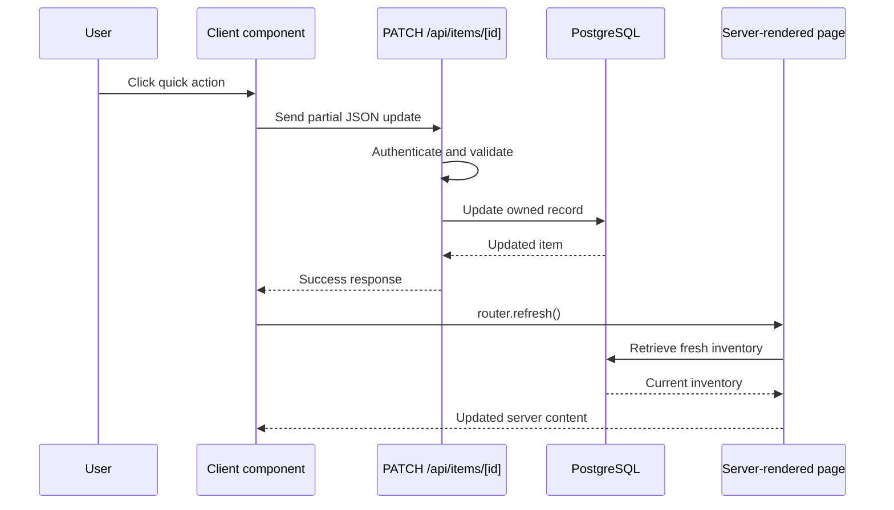
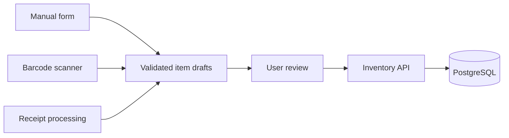

# MyKitchen Architecture

## Overview

MyKitchen is a full-stack application built with the Next.js App Router.

It combines:

- Server-rendered application pages
- Client-side interactive components
- Authenticated API route handlers
- Zod request validation
- A Prisma data-access layer
- PostgreSQL persistence
- Clerk authentication

## System Diagram



## Authentication

Clerk handles:

- User registration
- Sign-in
- Sessions
- User identifiers
- User-menu controls

Protected application pages are grouped under:

```text
app/(app)
```

The protected layout checks authentication before rendering its children.

API routes perform their own authentication checks. Page protection does not prevent an unauthenticated caller from attempting a direct API request.

## Authorization and Data Ownership

Every kitchen item belongs to a Clerk user through its `userId`.

Database queries that operate on an existing item include both:

- The item UUID
- The authenticated user's Clerk ID

Conceptually:

```text
Find item where:
  id = requested item ID
  AND
  userId = authenticated user ID
```

This prevents one authenticated user from reading, editing, or deleting another user's inventory.

The application never treats possession of an item UUID as proof of ownership.

## Request Validation

Zod schemas are defined in:

```text
validations/item.ts
```

They validate:

- Create-item requests
- Partial update requests
- Client-side form submissions

Client-side validation provides fast feedback, but the server always validates again because browser input cannot be trusted.

Dynamic item route parameters are also validated as UUIDs before database access.

## Data Access

Prisma is the only interface used by application code to communicate with PostgreSQL.

Important files include:

```text
prisma/schema.prisma
prisma.config.ts
lib/prisma.ts
lib/items/queries.ts
lib/items/serializers.ts
```

### Responsibilities

`lib/prisma.ts`

- Configures Prisma
- Configures the PostgreSQL adapter
- Reuses the client during development

`lib/items/queries.ts`

- Owns inventory database operations
- Applies user ownership requirements
- Maps validated application input into Prisma operations

`lib/items/serializers.ts`

- Converts Prisma values into application-safe values
- Converts Prisma Decimal values into numbers
- Converts dates into date-only strings

## Rendering Model

The application uses both server and client components.

### Server responsibilities

- Check authentication
- Retrieve inventory data
- Render initial application state
- Keep database credentials on the server

### Client responsibilities

- Search and filter already-loaded inventory
- Submit forms
- Delete items
- Perform quantity changes
- Mark items as opened
- Refresh server-rendered data after a mutation

## Mutation Flow

Quick actions follow this flow:



The MVP uses server-confirmed updates rather than optimistic updates.

This is simpler and avoids displaying a successful change before the database confirms it.

## Current Concurrency Limitation

Quick quantity actions currently calculate an absolute value in the browser:

```text
Current quantity: 2
User clicks +
Request body: { quantity: 3 }
```

If two devices update the same item simultaneously, the later request could overwrite the earlier request.

For a personal MVP, this is acceptable.

A future implementation could use:

- Atomic database increments
- Version numbers
- Optimistic concurrency control

## Date Model

Kitchen items contain:

```text
dateBought
openedDate
expirationDate
```

`dateBought` is required.

`openedDate` and `expirationDate` are optional.

These values represent calendar dates rather than specific moments in time.

## Expiration Status

Expiration status is derived at request or render time:

```text
expired
expiring_soon
fresh
no_date
```

It is not stored in the database.

Storing it would produce stale data. An item marked `fresh` today could become expired later without any database update.

## Image Resolution

The current image system uses a deterministic resolver:

```text
Item name
  |
  v
Normalize text
  |
  v
Check phrase rules
  |
  +--> Match found: use local suggested image
  |
  +--> No match: use category icon
```

This approach provides a visual inventory without:

- External image APIs
- Image-generation costs
- File uploads
- Storage configuration
- Additional database fields

## Future Automated Item Entry

Future import methods should create drafts rather than immediately saving inventory records.



Barcode and receipt data can be incomplete or inaccurate. Requiring review prevents bad records from entering the inventory.

## Important Invariants

The application should preserve these rules:

1. Every inventory item belongs to exactly one Clerk user.
2. API routes authenticate independently from page layouts.
3. Item ownership is enforced inside database queries.
4. External input passes Zod validation.
5. Item route parameters are valid UUIDs.
6. Date-only values remain date-only throughout serialization.
7. Expiration status is derived rather than stored.
8. Automated imports require user confirmation.
9. Secret credentials are never sent to the browser or committed to Git.
